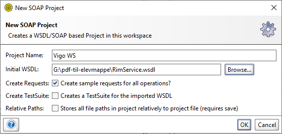
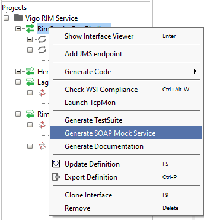
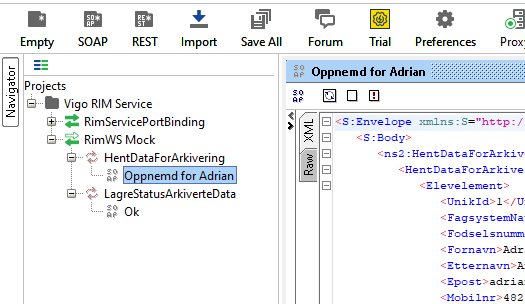
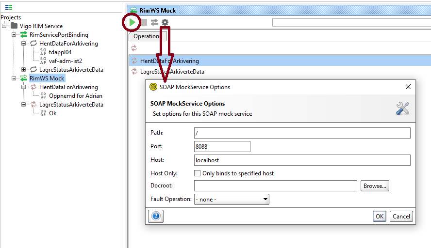
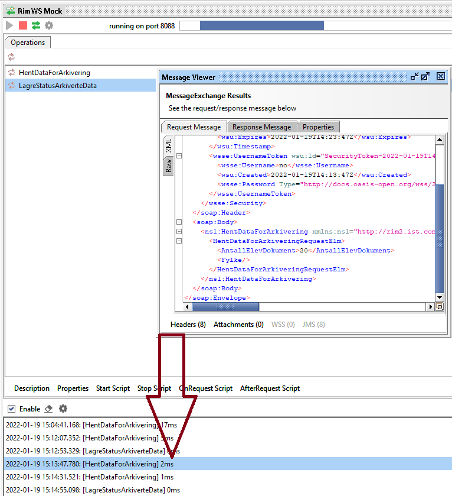

# Utviklingsoppsett

## SopaUI

[Et Nyttig verktøy](https://www.soapui.org/) når en jobber med Vigos webservice.

* Lag et nytt SOAP-prosjekt og les WDSL'en.

* Høyreklikk på prosjektet for å opprette mock-service

* Legg til respons-data for hver service

* Åpne mock-servicen med dobbelklik. Kjør mock med play-knapp, åpne options med tannhjulet
    * options eksempel path: `/`, port: `8088`, host: `localhost`

* Sjekke request og response under kjøring ved å dobbelklikke på forespørsel loggen i bunnen av mock-vindu

## Typiske feil

> Uncaught Error: Error: Unexpected root element of WSDL or include

Kjører mocken? Sjekk at innstillinger og .env er i overenstemmelse.